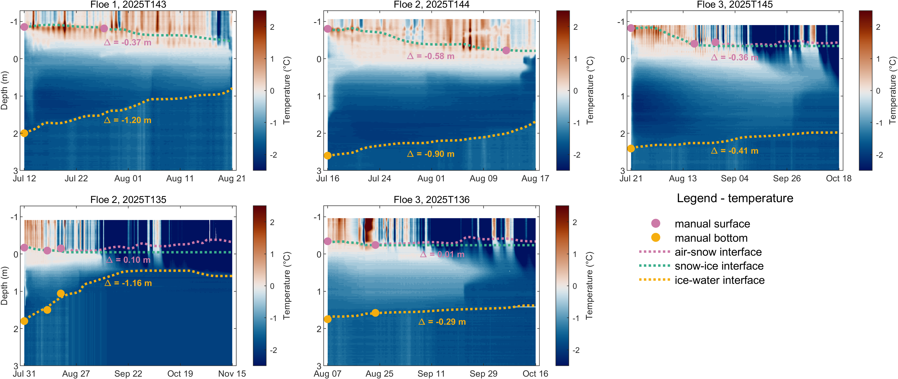

# CONTRASTS-SIMBA Processing Workflow

[](https://doi.org/10.5281/zenodo.20274778)

MATLAB processing workflow for deriving snow depth, sea ice thickness, temperature products, and geolocation information from SIMBA (Snow and Ice Mass Balance Array) buoys deployed during the CONTRASTS expedition in 2025.

This repository contains the scripts used to generate the published PANGAEA datasets for SIMBA buoys 2025T143, 2025T144, 2025T145, 2025T135, and 2025T136.



## Repository Structure

```text
colormaps/
data/
├── raw/
└── interfaces/

export_netcdf/
export_excel/
figures/

scripts_extra/

a_Contrasts_SIMBA_netcdf.m
b_Contrasts_SIMBA_excel.m
c_Contrasts_SIMBA_plotting.m
d_Contrasts_SIMBA_map.m
```

## Workflow

1. **a_Contrasts_SIMBA_netcdf.m**

   * Reads raw SIMBA data
   * Performs quality control
   * Processes geolocation and interfaces
   * Exports NetCDF files

2. **b_Contrasts_SIMBA_excel.m**

   * Creates Excel exports from NetCDF files

3. **c_Contrasts_SIMBA_plotting.m**

   * Generates temperature and heating figures

4. **d_Contrasts_SIMBA_map.m**

   * Generates buoy drift maps and geolocation diagnostics

## Published Datasets

The processed datasets generated using this workflow are available through PANGAEA:

| Buoy     | DOI                                    |
| -------- | -------------------------------------- |
| 2025T143 | https://doi.org/10.1594/PANGAEA.994096 |
| 2025T144 | https://doi.org/10.1594/PANGAEA.994100 |
| 2025T145 | https://doi.org/10.1594/PANGAEA.994105 |
| 2025T135 | https://doi.org/10.1594/PANGAEA.994087 |
| 2025T136 | https://doi.org/10.1594/PANGAEA.994092 |

## Requirements

* MATLAB
* NetCDF support
* M_Map toolbox

## Repository Citation

If you use or adapt this processing workflow, please cite:

> Salganik, E., Divine, D. V., Tao, R., Nicolaus, M., & Granskog, M. A. (2026). *Processing script for snow depth and sea ice thickness from SIMBA buoys 2025T143, 2025T144, 2025T145, 2025T135, and 2025T136 during the CONTRASTS expedition*. Zenodo. https://doi.org/10.5281/zenodo.20274778

## Data Citation

If you use the processed data products, please cite the corresponding PANGAEA dataset(s).

## Acknowledgements

This workflow uses:

* **M_Map**: Pawlowicz, R. (2020). *M_Map: A mapping package for MATLAB*, version 1.4m. http://www.eoas.ubc.ca/~rich/map.html
* **Scientific Colour Maps**: Crameri, F. (2018). *Scientific colour maps*. Zenodo. https://doi.org/10.5281/zenodo.1243862

## Authors

Evgenii Salganik
Dmitry Divine
Ran Tao
Marcel Nicolaus
Mats A. Granskog
